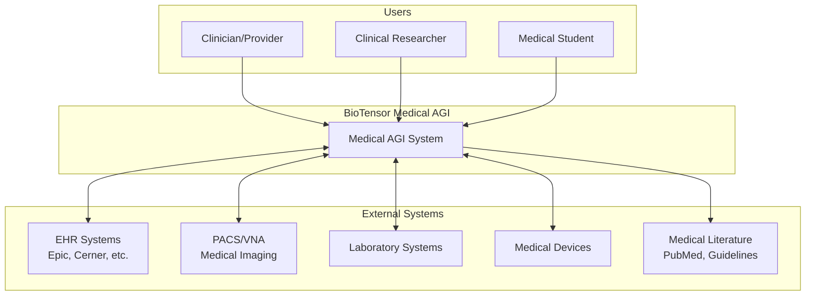
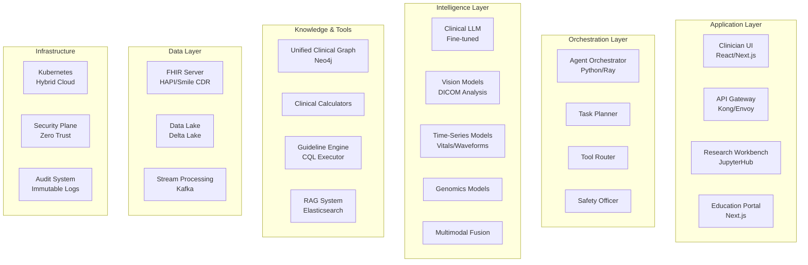
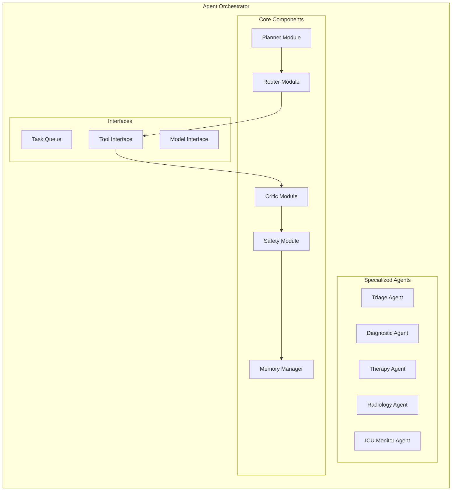
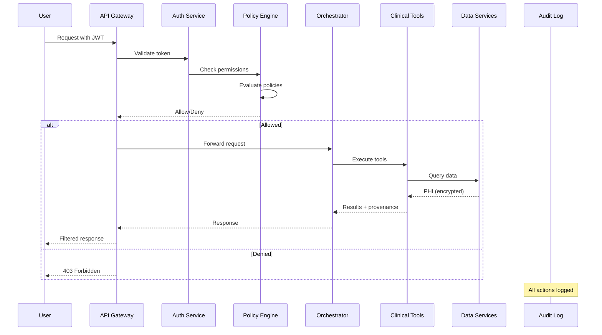

# BioTensor Labs Medical AGI - Architecture

## C4 Model Documentation

### Level 1: System Context



### Level 2: Container Diagram



### Level 3: Component Diagram - Agent Orchestrator



## Security Architecture

### Zero-Trust Network Architecture

```yaml
network:
  segmentation:
    - name: phi_zone
      description: "Protected Health Information"
      controls:
        - mTLS required
        - No internet egress
        - Audit all access
    
    - name: compute_zone
      description: "Model training/inference"
      controls:
        - GPU isolation
        - Resource quotas
        - Network policies
    
    - name: public_zone
      description: "User interfaces"
      controls:
        - WAF protection
        - DDoS mitigation
        - Rate limiting

authentication:
  methods:
    - SAML 2.0 (institutional SSO)
    - OAuth 2.0 + OIDC
    - mTLS for service-to-service
  
  mfa:
    required: true
    methods: ["TOTP", "FIDO2", "SMS backup"]

authorization:
  engine: "Open Policy Agent (OPA)"
  policies:
    - clinical_roles.rego
    - purpose_of_use.rego
    - data_classification.rego
```

### Data Flow Architecture



## Deployment Architecture

### Kubernetes Architecture

```yaml
clusters:
  - name: on-premise
    purpose: "PHI processing"
    nodes:
      - type: control-plane
        count: 3
      - type: gpu-compute
        count: 10
        gpu: "NVIDIA A100"
      - type: cpu-compute
        count: 20
  
  - name: cloud
    provider: "AWS/GCP/Azure"
    purpose: "De-identified workloads"
    nodes:
      - type: spot-instances
        autoscaling: true
        min: 5
        max: 100

storage:
  classes:
    - name: phi-encrypted
      encryption: "AES-256-GCM"
      backup: "hourly snapshots"
    - name: model-cache
      type: "NVMe SSD"
    - name: audit-logs
      immutable: true
      retention: "7 years"
```

## Performance Requirements

### SLOs (Service Level Objectives)

| Service | Latency (p99) | Availability | Throughput |
|---------|---------------|--------------|------------|
| Clinical API | < 100ms | 99.9% | 10K req/s |
| Risk Calculators | < 50ms | 99.99% | 50K req/s |
| LLM Inference | < 2s | 99.5% | 100 req/s |
| Image Analysis | < 5s | 99% | 20 req/s |
| Batch Processing | - | 99% | 1M records/hr |

### Scalability Targets

- **Concurrent Users**: 10,000 clinicians
- **Patient Records**: 100M+ 
- **Daily Transactions**: 50M+
- **Model Updates**: < 1hr deployment
- **Disaster Recovery**: RTO < 15min, RPO < 5min

## Technology Stack

### Core Technologies

| Layer | Technology | Purpose |
|-------|------------|---------|
| Frontend | React, Next.js | Clinical UIs |
| API | FastAPI, gRPC | Service APIs |
| Orchestration | Ray, Airflow | Distributed compute |
| ML Framework | PyTorch, JAX | Model training/inference |
| Graph DB | Neo4j | Clinical knowledge graph |
| Search | Elasticsearch | Document retrieval |
| Stream | Kafka | Event streaming |
| Lake | Delta Lake | Structured storage |
| Container | Docker, K8s | Orchestration |
| Monitoring | Prometheus, Grafana | Observability |

### Clinical Standards

- **Messaging**: HL7 v2.x, FHIR R4/R5
- **Imaging**: DICOM, DICOMweb
- **Terminology**: SNOMED CT, LOINC, RxNorm, ICD-10
- **Guidelines**: CQL (Clinical Quality Language)
- **Security**: HIPAA, HITRUST, SOC2