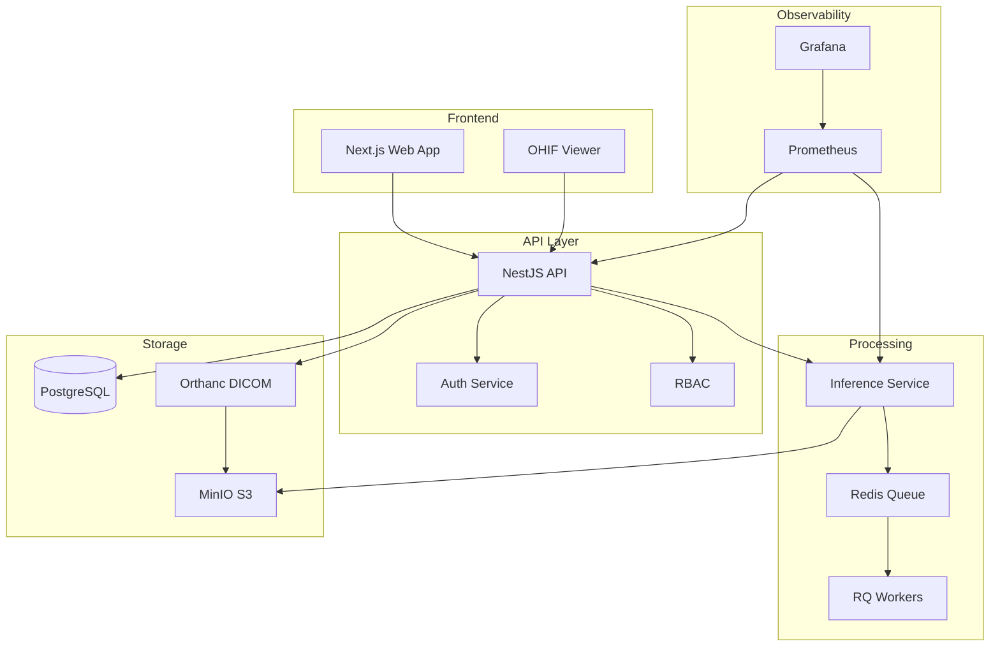

# MediMetrics Enterprise 🏥

> HIPAA-compliant Medical Image Analysis Platform with AI-powered diagnostics

[](https://github.com/medimetrics/medimetrics/actions)
[](LICENSE)
[](https://www.typescriptlang.org/)
[](https://nestjs.com/)
[](https://nextjs.org/)

## 🚀 Quick Start

```bash
# Clone and setup
git clone https://github.com/yourorg/medimetrics-enterprise.git
cd medimetrics-enterprise

# Configure environment
cp .env.example .env

# Initialize (creates DBs, seeds data, builds containers)
make init

# Launch entire stack
docker compose up --build

# OR use production profile
docker compose --profile prod up --build
```

## 🌐 Access Points

| Service | URL | Credentials |
|---------|-----|-------------|
| Web App | http://localhost:3000 | admin@demo.local / Demo123! |
| API Docs | http://localhost:8000/swagger | - |
| Grafana | http://localhost:3001 | admin / admin |
| Orthanc | http://localhost:8042 | orthanc / orthanc |
| MinIO Console | http://localhost:9001 | medimetrics / medimetricssecret |
| Prometheus | http://localhost:9090 | - |

## 🏗️ Architecture



## 🧪 Testing

```bash
# Run all tests
make test

# Unit tests
make test-unit

# Integration tests
make test-integration

# E2E tests (Playwright)
make test-e2e

# Load testing
make test-load
```

## 📊 Features

### Core Capabilities
- ✅ **DICOM Support**: Full DICOM parsing, storage, and viewing via OHIF
- ✅ **AI Analysis**: Classification & segmentation with explainability (Grad-CAM)
- ✅ **Multi-tenancy**: Organization-based data isolation
- ✅ **RBAC**: Role-based access control (Admin, Radiologist, Technologist, Client)
- ✅ **PHI Protection**: Field-level encryption, audit logging, redaction
- ✅ **2FA**: TOTP-based two-factor authentication
- ✅ **Report Generation**: Automated PDF reports with findings
- ✅ **Real-time Metrics**: Prometheus + Grafana dashboards
- ✅ **Scalable Queue**: Redis + RQ for async processing

### Security Features
- 🔐 JWT authentication with refresh tokens
- 🔐 CSRF protection on all state-changing operations
- 🔐 Rate limiting (configurable per endpoint)
- 🔐 Field-level encryption for PHI
- 🔐 Audit logging with redaction
- 🔐 Signed S3 URLs with short TTL
- 🔐 Network isolation in Kubernetes
- 🔐 Secrets management (Vault/KMS ready)

## 🚢 Deployment

### Docker Compose (Development)
```bash
docker compose up --build
```

### Docker Compose (Production)
```bash
docker compose --profile prod up -d --build
```

### Kubernetes
```bash
# Development
kubectl apply -k k8s/overlays/dev

# Production
kubectl apply -k k8s/overlays/prod

# Monitor rollout
kubectl rollout status deployment/medimetrics-api -n medimetrics
```

### Helm
```bash
helm install medimetrics ./charts/medimetrics \
  --namespace medimetrics \
  --create-namespace \
  --values charts/medimetrics/values.production.yaml
```

## 📈 Performance

- **Inference Throughput**: 100+ images/minute (GPU)
- **API Response Time**: <100ms p95
- **Upload Speed**: 10GB/min (parallel chunks)
- **Concurrent Users**: 1000+ (horizontally scalable)
- **Storage**: Unlimited (S3 compatible)

## 🔧 Configuration

Key environment variables:

```bash
# Authentication
JWT_SECRET=<generate-with-openssl>
CSRF_SECRET=<generate-with-openssl>
FIELD_ENCRYPTION_KEK=<generate-with-openssl>

# Database
POSTGRES_HOST=postgres
POSTGRES_DB=medimetrics
POSTGRES_USER=postgres
POSTGRES_PASSWORD=<strong-password>

# S3 Storage
S3_ENDPOINT=https://s3.amazonaws.com
S3_ACCESS_KEY=<aws-access-key>
S3_SECRET_KEY=<aws-secret-key>
S3_REGION=us-east-1

# Rate Limiting
RATE_LIMIT_GLOBAL=1000/minute
RATE_LIMIT_AUTH=10/minute
```

## 📚 Documentation

- [API Documentation](http://localhost:8000/swagger)
- [Architecture Guide](docs/ARCHITECTURE.md)
- [Security Practices](SECURITY.md)
- [HIPAA Compliance](COMPLIANCE.md)
- [Model Cards](MODEL_CARD.md)
- [Runbook](RUNBOOK.md)

## 🤝 Contributing

Please read [CONTRIBUTING.md](CONTRIBUTING.md) for our code of conduct and development process.

## 📄 License

This project is licensed under the Apache License 2.0 - see [LICENSE](LICENSE) file.

## ⚠️ Disclaimer

This software is for research and development purposes. Not FDA approved. See [DISCLAIMER.md](DISCLAIMER.md).

## 🏥 HIPAA Compliance Status

| Requirement | Status | Notes |
|------------|--------|-------|
| Access Controls | ✅ | RBAC + 2FA |
| Audit Controls | ✅ | Comprehensive logging |
| Integrity Controls | ✅ | Checksums + versioning |
| Transmission Security | ✅ | TLS 1.3 + VPN |
| Encryption at Rest | ✅ | AES-256-GCM |
| BAA Required | ⚠️ | Coordinate with legal |

## 🚀 Production Checklist

- [ ] SSL/TLS certificates configured
- [ ] Database backups automated
- [ ] Monitoring alerts configured
- [ ] Rate limiting tuned
- [ ] WAF rules enabled
- [ ] Penetration testing completed
- [ ] BAA signed with cloud provider
- [ ] Disaster recovery tested
- [ ] Security training completed